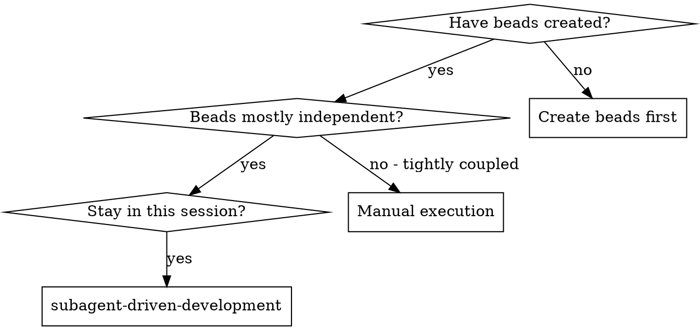
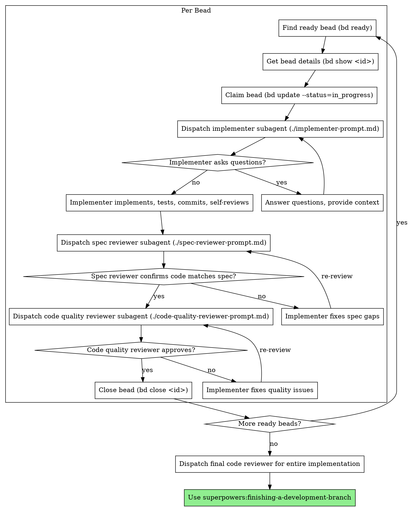

# Subagent-Driven Development

Execute beads by dispatching fresh subagent per bead, with two-stage review after each: spec compliance review first, then code quality review.

**Core principle:** Fresh subagent per bead + two-stage review (spec then quality) = high quality, fast iteration

## When to Use



**Key differences from plan-based approach:**
- Uses `bd ready` to find available work (not reading plan file)
- Uses `bd show <id>` to get bead specification (not extracting from file)
- Uses `bd update --status=in_progress` to claim work (not TodoWrite)
- Uses `bd close <id>` to complete work (not marking todo done)
- Beads persist across sessions (not lost on context clear)
- Dependencies automatically block work (no manual tracking)

## The Process



## Workflow Commands

**Finding work:**
```bash
# Find available beads (no blockers, status=open)
bd ready

# Get full specification for a bead
bd show beads-abc123

# Check all in-progress work
bd list --status=in_progress
```

**Claiming work:**
```bash
# Mark bead as in progress
bd update beads-abc123 --status=in_progress
```

**Completing work:**
```bash
# Close single bead
bd close beads-abc123

# Close multiple beads at once (more efficient)
bd close beads-abc123 beads-def456 beads-ghi789

# Close with reason
bd close beads-abc123 --reason="Implemented with React hooks"
```

**Checking progress:**
```bash
# See what's blocking remaining work
bd blocked

# View dependency tree
bd dep tree beads-abc123

# Project statistics
bd stats
```

## Prompt Templates

- `./implementer-prompt.md` - Dispatch implementer subagent
- `./spec-reviewer-prompt.md` - Dispatch spec compliance reviewer subagent
- `./code-quality-reviewer-prompt.md` - Dispatch code quality reviewer subagent

## Example Workflow

```
You: I'm using Subagent-Driven Development to execute these beads.

[Run bd ready to find available work]
$ bd ready
beads-a3f2dd: Setup database schema (priority: 1)
beads-7b8c21: Create API authentication middleware (priority: 1)

[Get first bead details]
$ bd show beads-a3f2dd
[Full specification shown]

[Claim the bead]
$ bd update beads-a3f2dd --status=in_progress

[Dispatch implementer subagent with bead specification]

Implementer: "Before I begin - should migrations be auto-applied or manual?"

You: "Manual - we'll have a separate migration script."

Implementer: "Got it. Implementing now..."
[Later] Implementer:
  - Created schema.sql and migration
  - Added tests, 5/5 passing
  - Self-review: Found I missed index on landlord_id, added it
  - Committed

[Dispatch spec compliance reviewer with bead spec]
Spec reviewer: ✅ Spec compliant - all requirements met, nothing extra

[Get git SHAs, dispatch code quality reviewer]
Code reviewer: Strengths: Good test coverage, clean. Issues: None. Approved.

[Close the bead]
$ bd close beads-a3f2dd

[Find next ready bead]
$ bd ready
beads-7b8c21: Create API authentication middleware (priority: 1)
beads-9d4e56: Implement landlord CRUD operations (priority: 1, blocked by beads-a3f2dd)

Wait, beads-9d4e56 should be unblocked now...
$ bd ready
beads-7b8c21: Create API authentication middleware (priority: 1)
beads-9d4e56: Implement landlord CRUD operations (priority: 1)

[Get next bead]
$ bd show beads-7b8c21
[Full specification shown]

[Claim and implement]
$ bd update beads-7b8c21 --status=in_progress
[Dispatch implementer...]

[Continue until bd ready returns no beads]

[After all beads complete]
[Dispatch final code-reviewer for entire implementation]
Final reviewer: All requirements met, ready to merge

Done!
```

## Advantages

**vs. Plan file approach:**
- No need to read/parse plan file
- Automatic dependency tracking
- Persistent across sessions
- Can see project health (`bd stats`, `bd blocked`)
- Multiple people can work on different beads
- Clear audit trail of what was implemented when

**vs. Manual execution:**
- Subagents follow TDD naturally
- Fresh context per bead (no confusion)
- Parallel-safe (subagents don't interfere)
- Subagent can ask questions (before AND during work)

**Efficiency gains:**
- Controller provides full bead text (no file reading)
- Beads contain complete information upfront
- Questions surfaced before work begins (not after)
- Dependencies prevent wasted effort on blocked work

**Quality gates:**
- Self-review catches issues before handoff
- Two-stage review: spec compliance, then code quality
- Review loops ensure fixes actually work
- Spec compliance prevents over/under-building
- Code quality ensures implementation is well-built

**Cost:**
- More subagent invocations (implementer + 2 reviewers per bead)
- Review loops add iterations
- But catches issues early (cheaper than debugging later)

## Red Flags

**Never:**
- Skip reviews (spec compliance OR code quality)
- Proceed with unfixed issues
- Dispatch multiple implementation subagents in parallel (conflicts)
- Skip `bd update --status=in_progress` (lose track of what's being worked on)
- Skip `bd close` (bead stays open forever)
- Ignore subagent questions (answer before letting them proceed)
- Accept "close enough" on spec compliance (spec reviewer found issues = not done)
- Skip review loops (reviewer found issues = implementer fixes = review again)
- Let implementer self-review replace actual review (both are needed)
- **Start code quality review before spec compliance is ✅** (wrong order)
- Move to next bead while either review has open issues

**If subagent asks questions:**
- Answer clearly and completely
- Provide additional context if needed
- Don't rush them into implementation

**If reviewer finds issues:**
- Implementer (same subagent) fixes them
- Reviewer reviews again
- Repeat until approved
- Don't skip the re-review

**If subagent fails bead:**
- Dispatch fix subagent with specific instructions
- Don't try to fix manually (context pollution)

**At session end:**
- Run `bd sync --from-main` to pull latest beads
- Commit your code changes
- In-progress beads stay in-progress (can resume later)

## Integration

**Required workflow skills:**
- **superpowers:writing-plans** - Creates the beads this skill executes
- **superpowers:requesting-code-review** - Code review template for reviewer subagents
- **superpowers:finishing-a-development-branch** - Complete development after all beads

**Subagents should use:**
- **superpowers:test-driven-development** - Subagents follow TDD for each bead
